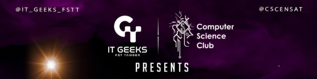

<p align="center">
  
</p>

<h1 align="center">🏆 CPC Scoreboard</h1>

<p align="center">
  <strong>A cinematic scoreboard & blind-hour reveal system for competitive programming contests.</strong><br>
  Turn the frozen scoreboard into a dramatic, animated experience on the big screen.
</p>

<p align="center">
  
  
  
  
</p>

---

## What is this?

During competitive programming contests (Codeforces, ICPC-style), the **last hour** of the scoreboard is typically **frozen** — participants can still submit, but the standings don't update publicly. This creates massive suspense.

**CPC Scoreboard** takes that suspense and turns it into a **visual spectacle**:

1. **Live Tracking** — connect to any Codeforces contest in real-time  
2. **Contest Timer** — countdown with color transitions (green → amber → red)  
3. **Blind Hour Reveal** — replays frozen submissions one by one with animations  
4. **Rank Animations** — contestants slide up/down the rankings in real-time  
5. **Confetti + Fanfare** — celebration when final standings are revealed  
6. **Awards Ceremony** — podium + three honorable mention badges  

Perfect for displaying on a **projector** at the end of a contest.

---

## Quick Start

```bash
# 1. Clone the repo
git clone https://github.com/MedGm/CPC-Scoreboard.git
cd CPC-Scoreboard

# 2. Install dependencies
pip install -r requirements.txt

# 3. Run the server
python3 app.py

# 4. Open in browser
# → http://localhost:5000
```

Enter a **Codeforces Contest ID** (e.g. `1950`) and click **Start Live Tracking**.

---

## Features

### Full Contest Lifecycle

| Phase | Description |
|-------|-------------|
| **Setup** | Enter contest ID, configure duration & freeze time |
| **Live** | Real-time scoreboard tracking with countdown timer |
| **Frozen** | Scoreboard freezes — blind hour begins |
| **Contest Ended** | Timer hits zero — ready for reveal |
| **Reveal** | Dramatic one-by-one submission replay |
| **Awards** | Podium + honorable mention badges |

### Core Features

- **Cinematic reveal** — submissions unlock one by one with pending/verdict animations
- **Smooth rank animations** — rows slide to new positions with cubic-bezier easing
- **Live countdown timer** — with color-coded urgency and progress bar
- **Synthesized sound effects** — Web Audio API (no external files needed)
- **Confetti celebration** — on reveal completion and awards
- **Podium + Awards** — top 3 showcase with honorable mentions
- **Projector-optimized** — large fonts, high contrast, Deep Plum palette
- **Zero build step** — vanilla HTML + JS, no npm required
- **Public API only** — uses Codeforces public API

---

## Project Structure

```
CPC-Scoreboard/
├── app.py                  # Flask server (API + static files)
├── requirements.txt        # Python dependencies
├── banner.png              # Project banner
├── backend/
│   ├── core.py             # Core logic (fetch, compute, replay)
│   ├── fetch_contest.py    # CLI tool for offline data
│   ├── generate_sample.py  # Demo data generator
│   └── tests/
│       └── test_score_logic.py
└── frontend/
    ├── index.html          # Main UI (HTML + CSS)
    └── js/
        ├── app.js          # App logic & reveal engine
        ├── api.js          # API wrapper class
        └── confetti.js     # Confetti animation
```

---

## API Endpoints

| Method | Endpoint | Description |
|--------|----------|-------------|
| `POST` | `/api/start` | Start tracking a contest |
| `GET` | `/api/standings` | Get current standings |
| `GET` | `/api/phase` | Get current phase + timer data |
| `POST` | `/api/reveal` | Build reveal data from blind-hour subs |
| `POST` | `/api/freeze` | Toggle scoreboard freeze |
| `POST` | `/api/reset` | Reset to setup |

---

## Tips for Big Screen Use

1. **Fullscreen the browser** (F11)
2. Set speed to **2.0–3.0s** for dramatic pacing
3. Enable sound and connect to speakers  
4. Use **Next** for the top-3 reveals (manual dramatic pauses)
5. The audience loves it when someone jumps 5+ ranks 🚀
6. Click **Show Awards** at the end for the podium ceremony

---

## Offline Mode

### Fetch contest data for offline use

```bash
cd backend
python fetch_contest.py 1234 --freeze-minutes 120
```

This exports a JSON file to `frontend/data/contest_1234.json`.

### Load offline data

1. Open `http://localhost:5000`
2. Click **Load JSON File** on the setup screen
3. Select your exported JSON
4. Hit **▶ Start Reveal**

### Generate sample data for testing

```bash
python backend/generate_sample.py --seed 42
```

---

## Testing

```bash
cd backend
python -m pytest tests/ -v
```

---

## License

MIT — Use freely for your contests.  
Built with ❤️ for the Moroccan competitive programming community.

<p align="center">
  <strong>IT Geeks × Computer Science Club</strong>
</p>
